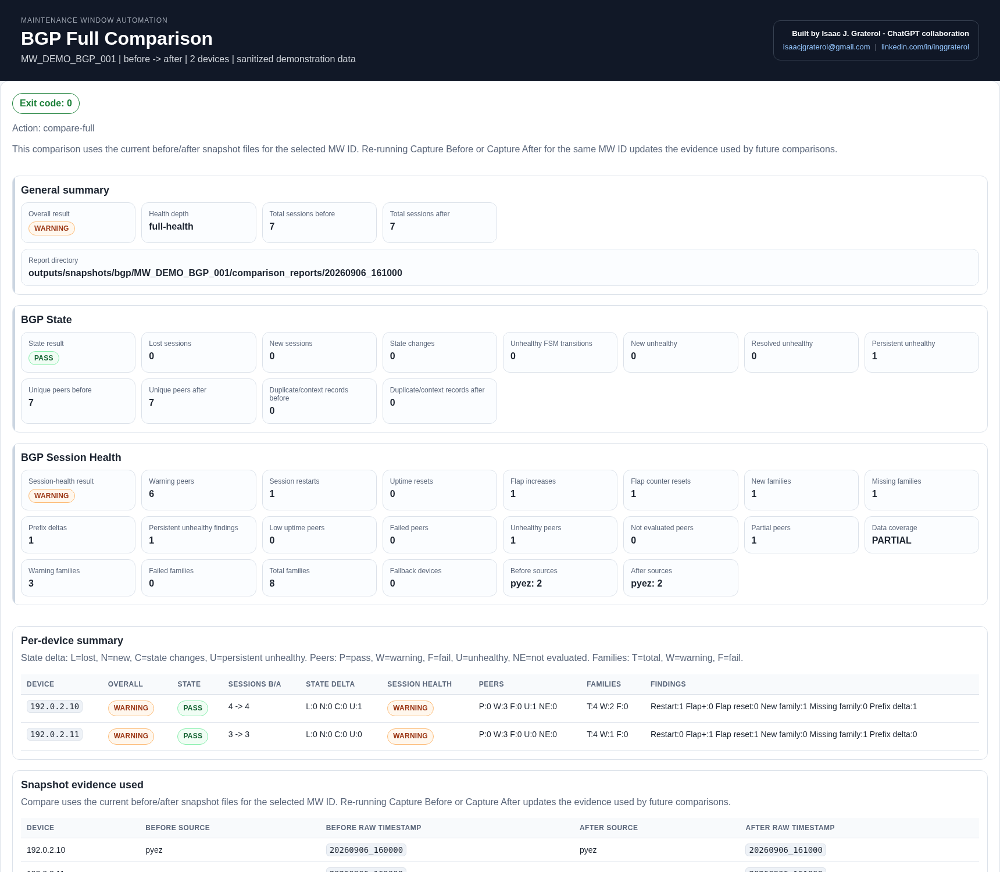
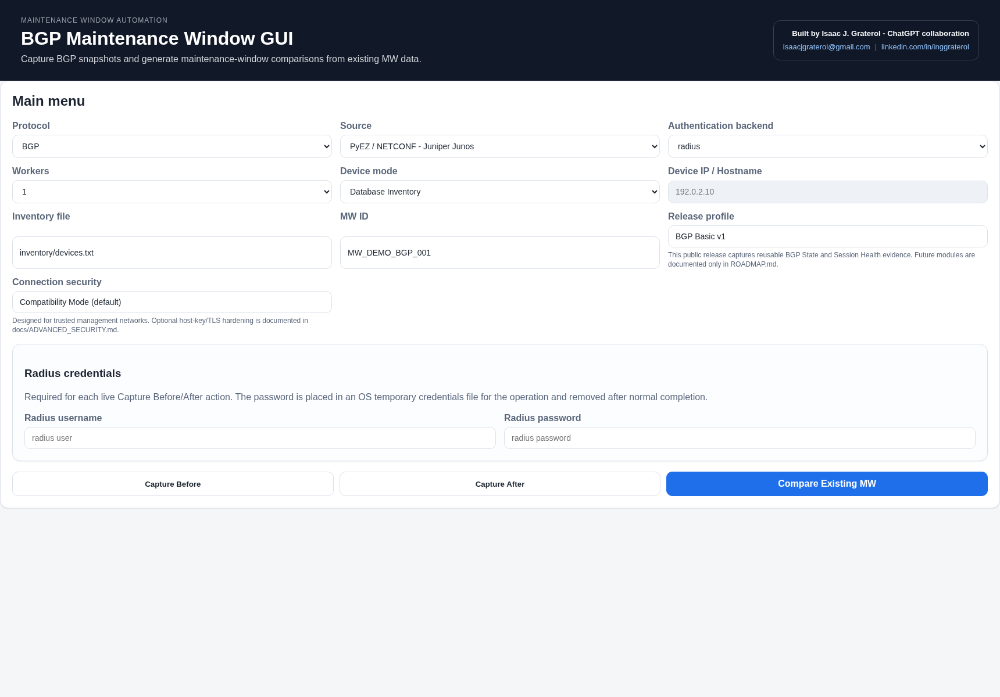

# Maintenance Window Automation - BGP v1.0.0

A read-only Python tool for comparing BGP operational state before and after a maintenance window. It preserves source-native evidence, normalizes data into a common model, and produces one compiled multi-device result.

The project was designed and led by **Isaac J. Graterol** and developed with **ChatGPT by OpenAI as an AI pair-programming collaborator**.

> The application does not configure network devices. Live device operations are read-only.

## v1.0.0 scope

- BGP State before/after comparison.
- BGP Session Health before/after comparison.
- Single-device and multi-device workflows.
- BEFORE and AFTER normalized snapshots per device.
- Source-native RAW evidence retention.
- Session restart detection using snapshot interval and BGP uptime continuity.
- Flap-count increase and flap-counter reset detection.
- Meaningful prefix-loss policy that ignores normal increases and small churn.
- Explicit `FULL`, `PARTIAL`, and `NOT_EVALUATED` data coverage.
- Requested-source versus actual-source visibility and fallback reporting.
- Same-source enforcement for official before/after comparisons.
- Combined JSON, Summary TXT, Detail TXT, and 3-page Executive PDF reports.
- Local web GUI and CLI.
- Offline/manual JSON and XML input.
- Automated offline regression suite: **348 tests** in the final v1.0.0 gate.

## Platform and source support

v1.0.0 is validated on **Windows 11 with Python 3.12**.

| Collection source | Network platform in v1.0.0 | Windows 11 workflow |
| --- | --- | --- |
| PyEZ / NETCONF | Juniper Junos | Native |
| SSH CLI JSON | Juniper Junos | Native |
| gNMI / OpenConfig | Juniper Junos validated | gNMIc through WSL |
| Manual JSON/XML | Offline evidence | Native |

**Cisco IOS XR and Nokia SR OS are not supported platforms in v1.0.0.** They are future research targets for the gNMI/OpenConfig path only. PyEZ/NETCONF and the current SSH CLI JSON collector remain Juniper Junos specific.

Linux validation is not part of v1.0.0. It remains demand-driven.

## Security modes

v1.0.0 intentionally starts in **Compatibility Mode (default)** so operators can evaluate the tool in trusted management networks that do not yet use SSH/NETCONF host-key verification or gNMI TLS.

Compatibility Mode favors reachability, not transport hardening. Use it only on a management network you trust.

An **Advanced Secure Mode** is available through `config/connections/settings.json` for environments that use known-host verification and TLS. See [Advanced Security](docs/ADVANCED_SECURITY.md) before enabling it.

Read-only collection and transport security are separate concepts: the tool does not change router configuration, but operators are still responsible for protecting credentials and management traffic.

## Evidence pipeline

```text
PyEZ / NETCONF       SSH CLI JSON       gNMI / OpenConfig
      |                   |                    |
      +--------- source-native RAW ------------+
                          |
                  source-specific parser
                          |
                   normalized BGP model
                          |
              per-device BEFORE / AFTER
                          |
                same-source comparison
                          |
             one compiled multi-device report
```

- PyEZ RAW evidence is Junos RPC XML.
- SSH RAW evidence is Junos CLI JSON.
- gNMIc RAW evidence is a JSON representation of gNMI notifications, normally `protojson`.
- Missing OpenConfig leaves remain unavailable; they are never converted into fake zeroes.

See [Architecture](docs/ARCHITECTURE.md) and [Result Policy](docs/RESULT_POLICY.md).

## Installation contract

**Git clone is the official installation method for v1.0.0.**

Requirements:

- Windows 11.
- Git for Windows.
- Python 3.12.
- Network reachability to the selected Juniper Junos devices.
- WSL plus gNMIc only when using the gNMI/OpenConfig source.

Quick start:

```powershell
New-Item -ItemType Directory -Force -Path "$HOME\Documents\NetworkTools" | Out-Null
Set-Location "$HOME\Documents\NetworkTools"

git clone https://github.com/isaacjgraterol-lab/maintenance-window.git
Set-Location .\maintenance-window

py -3.12 -m venv .venv
.\.venv\Scripts\python.exe -m pip install --upgrade pip
.\.venv\Scripts\python.exe -m pip install -e .

Copy-Item .\auth\credentials.example.json .\auth\credentials.json
Copy-Item .\inventory\devices.example.txt .\inventory\devices.txt
```

For a first installation, use the complete [Windows 11 Installation Guide](docs/WINDOWS_INSTALLATION.md).

## Run the GUI

```powershell
.\.venv\Scripts\python.exe .\gui.py 8765
```

Open:

```text
http://127.0.0.1:8765
```

The GUI is designed for local use and binds to loopback. Do not expose it directly to an untrusted network.

## GUI preview

The following screenshot is generated from the real result-page renderer with synthetic documentation-only data.



<details>
<summary>Show the main GUI</summary>



</details>

## CLI workflow

Capture BEFORE:

```powershell
.\.venv\Scripts\python.exe .\main.py `
  --protocol bgp `
  --source pyez `
  --auth-backend local `
  --snapshot before `
  --mw-id MW_DEMO_001 `
  --device 192.0.2.10 `
  --filter all `
  --workers 1 `
  --output summary
```

Capture AFTER with the same MW ID:

```powershell
.\.venv\Scripts\python.exe .\main.py `
  --protocol bgp `
  --source pyez `
  --auth-backend local `
  --snapshot after `
  --mw-id MW_DEMO_001 `
  --device 192.0.2.10 `
  --filter all `
  --workers 1 `
  --output summary
```

Compare the existing snapshots:

```powershell
.\.venv\Scripts\python.exe .\main.py `
  --protocol bgp `
  --module full `
  --compare-snapshots before,after `
  --mw-id MW_DEMO_001 `
  --device 192.0.2.10 `
  --output summary
```

Official comparison requires the same actual source before and after:

```text
PyEZ  -> PyEZ
SSH   -> SSH
gNMIc -> gNMIc
```

Cross-source analysis is a diagnostic workflow and is not treated as the official maintenance-window result.

## Sanitized example

The repository contains a synthetic report set generated through the real parser, snapshot, comparison, reporting, PDF, and GUI-rendering paths.

It demonstrates:

- `Established -> Established` with a detected session restart;
- a flap-count increase;
- a flap-counter reset/decrease;
- one new family after the maintenance;
- one family/table missing after the maintenance;
- one meaningful prefix loss that triggers the real `prefix_delta` policy;
- one pre-existing unhealthy peer that remains unhealthy;
- global and per-device results.

The example uses only reserved documentation address space and contains no production/customer evidence.

- [Summary TXT](docs/examples/MW_DEMO_BGP_001_summary.txt)
- [Detail TXT](docs/examples/MW_DEMO_BGP_001_detail.txt)
- [Executive PDF](docs/examples/MW_DEMO_BGP_001_executive_report.pdf)
- [Example generation and sanitization notes](docs/examples/README.md)

## Output structure

```text
outputs/
├── raw/<source>/
├── snapshots/bgp/<MW_ID>/<stage>/<device>.json
├── snapshots/bgp/<MW_ID>/<stage>/reports/<timestamp>/
└── snapshots/bgp/<MW_ID>/comparison_reports/<timestamp>/
```

Generated outputs can contain operationally sensitive information and are ignored by Git.

## Tests and publication audit

Development/CI gate:

```powershell
.\.venv\Scripts\python.exe -m compileall -q src tests tools
.\.venv\Scripts\python.exe -m pytest -q
.\.venv\Scripts\python.exe .\tools\public_release_check.py --root .
```

No live router is required for the offline test suite.

## Roadmap

The planned sequence is deliberately staged:

1. Extend the common State workflow to LDP, IS-IS, OSPF, and RSVP.
2. Keep one GUI and one multi-device reporting model.
3. After State coverage is complete, return to advanced modules beginning with BGP Routes / Prefixes and BGP VPN / Services.
4. Research cross-vendor gNMI/OpenConfig capability discovery for Cisco IOS XR and Nokia SR OS without changing the Junos-specific PyEZ/SSH collectors.

See [ROADMAP.md](ROADMAP.md).

## Documentation

- [Windows 11 Installation Guide](docs/WINDOWS_INSTALLATION.md)
- [Operator Guide](docs/OPERATOR_GUIDE.md)
- [Architecture](docs/ARCHITECTURE.md)
- [Result Policy](docs/RESULT_POLICY.md)
- [Advanced Security](docs/ADVANCED_SECURITY.md)
- [Development Guide](docs/DEVELOPMENT.md)
- [Sanitized Examples](docs/examples/README.md)
- [Release Notes](docs/GITHUB_RELEASE_NOTES.md)
- [Roadmap](ROADMAP.md)

## Contact

Isaac J. Graterol

- Email: [isaacjgraterol@gmail.com](mailto:isaacjgraterol@gmail.com)
- LinkedIn: [linkedin.com/in/inggraterol](https://www.linkedin.com/in/inggraterol)

## Contributing

Code review, platform testing, parser improvements, documentation corrections, and issue reports are welcome. See [CONTRIBUTING.md](CONTRIBUTING.md).

## License

MIT License. See [LICENSE](LICENSE).

This software is provided without warranty. Validate it in a lab before production use.
